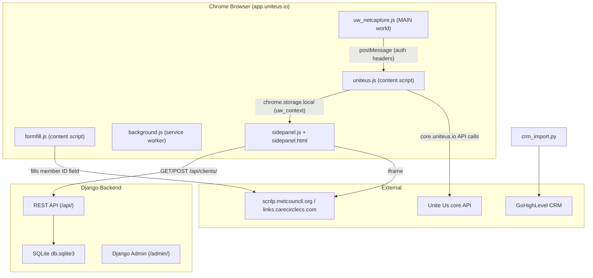

# Architecture

CareCircle has two halves: a **Chrome extension** that runs inside the Unite Us web app,
and a **Django REST API** that stores the normalized data and (optionally) syncs it to
the GoHighLevel CRM. The extension captures data from the live Unite Us facesheet,
compares it against the backend, and lets the coordinator save it and pre-fill embedded
enrollment forms.

For component-level detail, see [chrome-extension.md](./chrome-extension.md),
[content-scripts.md](./content-scripts.md), [sidepanel.md](./sidepanel.md), and
[django-api.md](./django-api.md).

## Component diagram

## Data flow narrative — Capture → Validate → Compare → Save

1. The user navigates to `https://app.uniteus.io/facesheet/<client_id>`.
2. `background.js` enables the side panel for this tab (it is only enabled on
   `app.uniteus.io` hosts).
3. `uw_netcapture.js` (MAIN world, injected at `document_start`) wraps `fetch` and
   `XMLHttpRequest` and emits the page's auth headers via `window.postMessage` whenever
   the page calls `screenings-ingestion.uniteus.io` or `core.uniteus.io`. It is
   read-only — it never alters or blocks requests.
4. `uniteus.js` receives those credentials and calls the Unite Us **core API** directly
   to enrich client demographics, insurance, social care coverage, care coordinator, and
   consent.
5. `uniteus.js` also scrapes the DOM (profile tab, insurance cards via `data-testid`
   attributes) and runs a resumable **auto-walk** crawler for screenings, eligibility,
   and cases.
6. All data is merged into a per-client accumulator and written to
   `chrome.storage.local` as `uw_context` (with companion keys `uw_accum`,
   `uw_screenings`, `uw_eligibility`, `uw_cases`).
7. `sidepanel.js` reads `uw_context`, calls `GET /api/clients/<uuid>/` to check whether
   the client already exists in the CRM/backend, and renders the schema-driven
   **Captured-vs-CRM** comparison.
8. The user clicks **Save**, which POSTs to `/api/clients/`, `/api/screenings/bulk/`,
   `/api/eligibility/bulk/`, and `/api/cases/bulk/` as appropriate.
9. `formfill.js` reads `uw_context.client_id` and fills the "Enrollment Platform Member
   ID" field in any embedded form iframe.

## Storage keys (`chrome.storage.local`)

The extension coordinates entirely through `chrome.storage.local`:

| Key | Written by | Purpose |
|---|---|---|
| `uw_context` | `uniteus.js` | Final per-client context consumed by the side panel and form-fill. |
| `uw_accum` | `uniteus.js` | Per-client accumulator merged across page navigations. |
| `uw_screenings` / `uw_eligibility` / `uw_cases` | `uniteus.js` | Auto-walk results per record type. |
| `uw_scr_scan` / `uw_elig_scan` / `uw_case_scan` | `uniteus.js` | Resumable auto-walk crawler state. |
| `uw_config` | side panel settings | Optional override of backend URL / token / scheme. |

See [content-scripts.md](./content-scripts.md) for the producers of these keys and
[sidepanel.md](./sidepanel.md) for the consumers.
