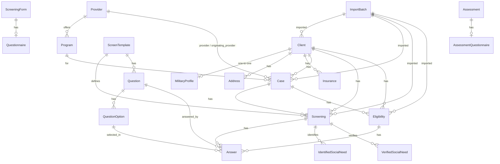

# Data Models

All models live in `api/models.py`. UUID primary keys mirror the source system (Unite
Us) external IDs so imports are idempotent upserts. Fields marked PII/PHI are commented as
such in the source — see [authentication.md](./authentication.md#security-notes). For how
these are exposed over HTTP, see [django-api.md](./django-api.md).

## ER diagram

## Client

Primary key `client_id` (UUID from Unite Us). The central PII record.

| Field | Type | Notes |
|---|---|---|
| `client_id` | UUIDField (PK) | Source external ID. |
| `created_by_id` / `created_by_name` | UUID / Char | Source agent. |
| `created_at` / `updated_at` | DateTime | Source timestamps. |
| `is_active` | Boolean | |
| `crm_contact_id` | Char (indexed) | GoHighLevel contact id. |
| `last_synced_at` | DateTime | Local ingest tracking (`auto_now`). |
| `import_batch` | FK → ImportBatch | |
| `first_name` / `middle_name` / `last_name` / `suffix` / `title` | Char | PII. |
| `date_of_birth` | Date | PII. |
| `gender` | Char (`Gender`) | |
| `sexuality` / `sexuality_other` / `race` / `ethnicity` / `citizenship` | Char | |
| `marital_status` | Char (`MaritalStatus`) | |
| `time_zone` | Char | Default `America/New_York`. |
| `enrollment_from` | Char | Default `Unite Us`. |
| `lead_source` | Char | |
| `eligible_for` / `referred_for` | JSONField (list) | Lists of `ServiceType` values; validated in the serializer. |
| `is_family` / `total_family_members` | Boolean / PosInt | |
| `attestation_needed` / `different_delivery_address` | Boolean | |
| `agent_code` | Char (indexed) | |
| `call_duration_minutes` | PosInt | Eligibility call length (minutes). |
| `call_transfer_answered` | Char (`CallTransferStatus`) | |
| `consent_status` | Char (`ConsentStatus`) | Default `pending`. |
| `consented_at` | DateTime | |
| `gross_monthly_income` | Decimal | |
| `household_size` / `adults_in_household` / `children_in_household` | PosInt | |
| `preferred_communication_method` / `communication_channel` | Char (`CommunicationChannel`) | |
| `preferred_communication_time_of_day` | JSONField | Per-weekday list of `CommunicationTimeOfDay` windows. |
| `preferred_spoken_language` / `preferred_written_language` | Char | |
| `phone_type` | Char (`PhoneType`) | Default `mobile`. |
| `client_phone_number` / `client_email_address` | Char / Email | PII. |
| `care_coordinator` / `care_coordinator_status` | Char | |

## MilitaryProfile

One-to-one to `Client` (keeps `Client` lean since most clients have no military data).

| Field | Type | Notes |
|---|---|---|
| `client` | OneToOne → Client | |
| `military_affiliation` | Char (`MilitaryAffiliation`) | |
| `branch` | Char (`MilitaryBranch`) | |
| `discharge_type` | Char (`DischargeType`) | |
| `military_entry_date` / `military_exit_date` | Date | |
| `currently_transitioning` / `at_least_one_day_active_duty` / `deployed` | Boolean (nullable) | |
| `deployment_start_date` / `deployment_end_date` | Date | |
| `service_era` / `current_status` | Char | |
| `discharged_due_to_disability` / `service_connected_disability` | Boolean (nullable) | |
| `service_connected_disability_rating` | PosSmallInt | 0–100. |
| `proof_of_veteran_status` / `proof_type` | Boolean / Char | |

## Address

FK to `Client`. Supports current/mailing/delivery with active/history tracking.

| Field | Type | Notes |
|---|---|---|
| `client` | FK → Client | |
| `address_type` | Char (`AddressType`) | current / mailing / delivery; default current. |
| `is_mailing_address` | Boolean | |
| `line1` / `line2` | Char | PII. |
| `city` / `county` | Char | |
| `postal_code` | Char | |
| `state` | Char (`USState`) | |
| `is_active` / `validated` | Boolean | |
| `added_by_name` | Char | |
| `created_at` / `updated_at` | DateTime | |

## Insurance

FK to `Client`. A client may hold multiple plans over time.

| Field | Type | Notes |
|---|---|---|
| `client` | FK → Client | |
| `plan_external_id` | Char (indexed) | |
| `plan_type` | Char (`InsurancePlanType`) | |
| `plan_name` | Char | |
| `insurance_id` | Char (indexed) | PII; upsert key when present. |
| `status` / `record_status` | Char (`RecordStatus`) | |
| `is_primary` | Boolean | |
| `external_group_id` | Char | |
| `external_member_id` | Char | PII. |
| `ingested` | Boolean | |
| `enrolled_at` / `expired_at` | DateTime | |
| `verified` / `verified_at` | Boolean / DateTime | `verified=True` rows are never auto-deactivated by reconcile. |
| `created_at` / `updated_at` | DateTime | |

## Provider

| Field | Type | Notes |
|---|---|---|
| `provider_id` | UUIDField (PK) | |
| `name` | Char | |
| `network_id` | UUID | |
| `network_name` | Char | |
| `is_active` | Boolean | |

## Program

| Field | Type | Notes |
|---|---|---|
| `program_id` | UUIDField (PK) | |
| `name` | Char | |
| `provider` | FK → Provider | |

## Case

UUID PK `case_id`. FK to `Client`, two `Provider` FKs (`provider`,
`originating_provider`), and `Program`.

| Field | Type | Notes |
|---|---|---|
| `case_id` | UUIDField (PK) | Source external ID. |
| `client` | FK → Client | |
| `client_first_name` / `client_last_name` / `client_dob` | Char / Date | Denormalized client snapshot; `client_dob` is PII/PHI. |
| `previous_case` | FK → self | |
| `created_by_id` / `created_by_name` / `created_at` / `updated_at` | mixed | Source metadata. |
| `product_id` | UUID | Placeholder for a future `Product` model. |
| `case_status` | Char (`CaseStatus`) | Default `open`. |
| `case_description` / `closed_note` | Text | |
| various date fields | Date / DateTime | `user_entered_opened_date`, `case_closed_at`, etc. |
| `network_id` / `network_name` | UUID / Char | |
| `originating_provider` / `provider` | FK → Provider | + denormalized `*_name` fields. |
| `program` / `program_name` | FK → Program / Char | |
| `primary_worker_id` / `primary_worker_name` | UUID / Char | |
| `care_coordinator` / `care_coordinator_status` | Char | |
| `service_type` (indexed) / `service_subtype` | Char | Free-text Unite Us taxonomy (see roadmap). |
| `outcome_id` / `outcome_description` | UUID / Text | |
| `outcome_resolution_type` | Char (`OutcomeResolutionType`) | |
| `service_authorization_status` | Char (`ServiceAuthorizationStatus`) | + raw `*_label`. |
| `authorized_amount` | Char | Free text: dollar amount or unit/time description. |
| `program_cap` / `authorization_note` | Text | |
| `social_care_coverage_plan` / `social_care_coverage_status` | Char | |
| `import_batch` | FK → ImportBatch | |

## ScreenTemplate

UUID PK `template_id` — a questionnaire definition.

| Field | Type | Notes |
|---|---|---|
| `template_id` | UUIDField (PK) | |
| `template_title` / `template_type` / `template_status` | Char | |
| `template_loinc_code` / `template_loinc_group` / `template_loinc_version` / `template_hcpcs_code` | Char | Clinical codes. |
| `template_snomed_codes` | JSONField (list) | |
| `parent_template` | FK → self | |
| `active_template` / `from_file` | Boolean | |

## Screening

UUID PK `enhanced_screen_id`. An enhanced screening for a client.

| Field | Type | Notes |
|---|---|---|
| `enhanced_screen_id` | UUIDField (PK) | |
| `subject_id` | UUID (indexed) | Source client reference; mapped to `client` on import. |
| `client` | FK → Client | |
| `case` | FK → Case | |
| `template` | FK → ScreenTemplate | |
| `screen_status` | Char (`ScreenStatus`) | |
| `screen_type` | Char (`ScreenType`) | |
| `eligible_status` / `eligible_services` | Char / JSONField | |
| `interpersonal_safety_riskscore` | Float | PHI. |
| `screen_snomed_codes` / `screen_icd10_codes` | JSONField (list) | |
| `consent` / `consent_code` | Boolean / Char | |
| `client_first_name` / `client_last_name` / `client_dob` | snapshot | `client_dob` is PII/PHI. |
| (plus outreach, decline, interpreter, verification, timing fields) | mixed | |

## Eligibility

UUID PK `eligibility_id`. Structurally the same shape as `Screening` but a separate
table. Import routing chooses between `Screening` and `Eligibility` based on the source
`screen_type` containing `"assess"` or `"eligib"` (see
[etl-import.md](./etl-import.md)). FKs to `Client` and `Case`.

## Question

| Field | Type | Notes |
|---|---|---|
| `question_id` | UUIDField (PK) | |
| `template` | FK → ScreenTemplate | |
| `parent_question` | FK → self | |
| `question_primary_text` / `question_secondary_text` | Text | |
| `question_type` / `question_category` | Char | |
| `question_loinc_code` / `question_loinc_version` / `question_hcpcs_code` | Char | |
| `question_required` / `question_is_active` / `admin_only` | Boolean | |

## QuestionOption

| Field | Type | Notes |
|---|---|---|
| `question_option_id` | UUIDField (PK) | |
| `question` | FK → Question | |
| `parent_question_option` | FK → self | |
| `question_option_text` | Text | |
| `question_option_loinc_code` / `question_option_icd10_codes` / `question_option_snomed_codes` | Char / JSONField | Clinical codes. |
| `question_option_score` / `question_option_weight` | Float | |
| `question_option_value` (+ `_bool` / `_float` / `_int`) | mixed | Typed option values. |

## Answer

A client's answer to a question, belonging to **either** a `Screening` **or** an
`Eligibility` assessment.

| Field | Type | Notes |
|---|---|---|
| `answer_id` | UUIDField (PK) | |
| `screening` | FK → Screening (nullable) | One of screening/eligibility is set. |
| `eligibility` | FK → Eligibility (nullable) | |
| `question` | FK → Question | |
| `question_option` | FK → QuestionOption | Selected option. |
| `answer_type` | Char (`AnswerType`) | |
| `answer_value` / `value_string` | Text | PHI. |
| `answer_value_bool` / `_datetime` / `_float` / `_int` | typed | |
| `answer_score` / `answer_weight` | Float | |
| `interpretations` | JSONField (list) | |

## IdentifiedSocialNeed / VerifiedSocialNeed

Both FK to `Screening`; each records a social need code + name (identified vs. verified).

| Field | Type | Notes |
|---|---|---|
| `*_social_need_id` | UUIDField (PK) | |
| `screening` | FK → Screening | |
| `*_social_need_code` / `*_social_need_name` | Char | |
| timestamps | DateTime | |

## ImportBatch

Tracks one CSV import run.

| Field | Type | Notes |
|---|---|---|
| `id` | int (PK) | |
| `source` | Char (`ImportSource`) | clients / cases / screenings. |
| `file_name` | Char | |
| `pull_start_date` / `pull_end_date` / `pull_timestamp` / `data_pulled_at` | Date/DateTime | Normalized per-row ETL metadata. |
| `row_count` / `success_count` / `error_count` | PosInt | |
| `status` | Char (`ImportStatus`) | pending / running / completed / failed. |
| `error_log` | Text | |
| `imported_by` | FK → User | |
| `imported_at` | DateTime | `auto_now_add`. |

## Placeholder models (future form builder)

`ScreeningForm`, `Questionnaire`, `Assessment`, and `AssessmentQuestionnaire` are
lightweight placeholder models for a future form-builder feature.
`Questionnaire` is one-to-one to `ScreeningForm`; `AssessmentQuestionnaire` is
one-to-one to `Assessment`. See [feature-roadmap.md](./feature-roadmap.md).

## Key enumerations

All are `models.TextChoices` in `api/models.py`:

- **`Gender`** — male, female, nonbinary, transgender, other, declined, unknown.
- **`MaritalStatus`** — single, married, partnered, separated, divorced, widowed, unknown.
- **`ConsentStatus`** — pending, accepted, declined, revoked, expired.
- **`CommunicationChannel`** — email, phone, text, mail.
- **`PhoneType`** — mobile, home, work.
- **`AddressType`** — current, mailing, delivery.
- **`USState`** — 50 states + DC.
- **`MilitaryAffiliation` / `MilitaryBranch` / `DischargeType`** — military taxonomy.
- **`InsurancePlanType`** — medicaid, medicare, commercial, marketplace, dual, self_pay, other.
- **`RecordStatus`** — active, pending, inactive, expired.
- **`ServiceType`** — 20+ social-care services (cooking_supplies, medically_tailored_meals, transportation, snap, tenancy, …).
- **`CommunicationTimeOfDay`** — morning, early_afternoon, late_afternoon, evening.
- **`CallTransferStatus`** — transfer_successful, transfer_failed, no_verification_needed.
- **`CaseStatus`** — draft, open, pending_authorization, managed, off_platform, closed, cancelled.
- **`OutcomeResolutionType`** — resolved, unresolved, referred_out, no_longer_needed, unable_to_contact, ineligible, other.
- **`ServiceAuthorizationStatus`** — not_required, pending, approved, denied, expired.
- **`ScreenStatus`** — pending, in_progress, completed, declined, cancelled, expired.
- **`ScreenType`** — standard, enhanced, eligibility, assessment, reassessment, follow_up.
- **`OutreachStatus`** — not_started, in_progress, attempted, reached, unreachable, completed.
- **`AnswerType`** — text, boolean, date, datetime, integer, float, single_select, multi_select.
- **`ImportSource`** — clients, cases, screenings.
- **`ImportStatus`** — pending, running, completed, failed.
