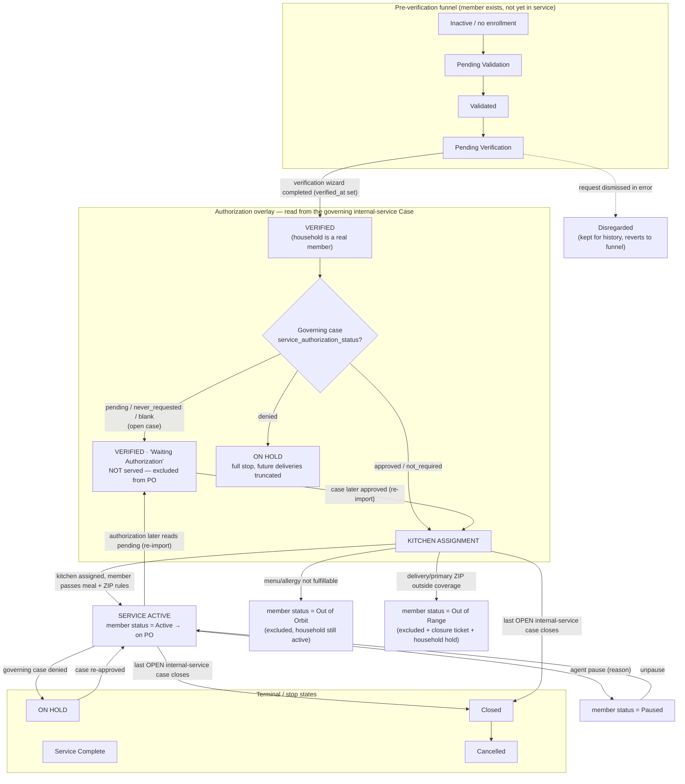

# Import Lifecycle & Stage Rules

How a CSV / Unite Us import decides what happens to an **individual member** and
their **household** at each lifecycle stage.

> **Source of truth in code**
> - Enums: `api/models.py` — `EnrollmentStage`, `MemberStatus`, `CaseStatus`, `ServiceAuthorizationStatus`
> - Import: `api/services/csv_import.py` — `map_case_row`, `CsvImporter.import_cases`, `reconcile_touched_cases`
> - Reconcile: `api/services/lifecycle.py` — `reconcile_internal_service_authorization`, `reconcile_enrollment_authorization`, `governing_case_key`
> - PO guardrails: `api/services/purchase_orders.py` — `open_internal_service_case_exists`, `authorized_internal_service_case_exists`

---

## The two dimensions (this is the key mental model)

Your list mixes two *separate* things. The system tracks them independently:

| Dimension | Applies to | Values | Set by |
|-----------|-----------|--------|--------|
| **Enrollment stage** | the **household** enrollment | `pending_validation` → `validated` → `pending_verification` → `verified` → `kitchen_assignment` → `service_active` → `service_complete`; plus `on_hold`, `closed`, `cancelled`, `disregarded` | verification wizard + case reconcile |
| **Authorization** (overlay, *not* a stage) | the governing **internal-service Case** | `not_required`, `pending`, `approved`, `denied`, `expired`, `never_requested` | imported from Unite Us; separate from case open/closed |
| **Member status** | each **individual member** | `active`, `out_of_orbit`, `out_of_range`, `paused`, `inactive` | kitchen assignment + meal/ZIP rules + agent |

**Authorization is never an enrollment stage.** "Pending authorization" and
"authorization approved" are both the **Verified** stage — the difference is the
Case's `service_authorization_status`. Only an **approval** moves the household
off Verified into Kitchen Assignment.

---

## Full stage flow diagram

---

## What the import rule DOES at each stage

The import writes cases (Open/Closed + authorization), then runs
`reconcile_internal_service_authorization(client)` **once per client** on the
complete case picture. Household members all follow the **case-holder's
governing internal-service case**.

### 1. Inactive / no enrollment
- No internal-service case → nothing to serve. `recompute_client_stage` keeps the
  member in the pre-verification funnel.
- **PO:** never included.

### 2. Pending Validation → Validated → Pending Verification
- Pre-verification funnel. Authorization on the case is **ignored** here — "a case
  accepted early just waits until the household is verified"
  (`_AUTH_ELIGIBLE_STAGES = {VERIFIED}`).
- **PO:** never included (not verified).

### 3. Verified → **Pending / Never-Requested** authorization
- Stage stays **Verified**, displayed as **"Waiting Authorization"**.
- If a household was previously advanced past Verified and the authorization now
  reads pending, `_downgrade_unauthorized_enrollment` pulls it **back to Verified
  and truncates future deliveries** (this is the CSV-import bug fix).
- **PO:** **excluded** — only an approval authorizes service.

### 4. Verified → **Approved** (or Not Required) authorization
- `reconcile_enrollment_authorization` advances **Verified → Kitchen Assignment**.
- Any enrollment auto-paused by a prior denial is **resumed**.
- **PO:** eligible once it reaches Service Active (see guardrails below).

### 5. Kitchen Assignment
- Household is authorized; each **member** now gets a `MemberStatus`:
  - `active` — meal type + allergies fulfillable and ZIP in range → proceeds to Service Active.
  - `out_of_orbit` — menu/allergy can't be safely fulfilled (`meal_rules`).
  - `out_of_range` — delivery/primary ZIP outside coverage (also opens a closure ticket + holds household).
- **PO:** only `active` members; excluded statuses = `out_of_orbit`, `out_of_range`, `paused`, `inactive`.

### 6. Service Active
- Member receives deliveries. Reversible transitions on re-import:
  - governing auth → **pending** ⇒ back to Verified/Waiting + truncate.
  - governing auth → **denied** ⇒ whole household **On Hold** + truncate.
  - last **OPEN** internal-service case **closes** ⇒ full stop: pause → truncate → cancel (household off all future POs).

### Household-wide rule (why dependents matter)
Only the **case-holder** holds the internal-service case. Dependents have none of
their own, so **all** eligibility is keyed on the case-holder's governing case:
- PO guardrails (`open_internal_service_case_exists`,
  `authorized_internal_service_case_exists`) both key on the **enrollment
  applicant (case-holder)** — so the whole household is served together or
  excluded together.
- **Served only when** the household has an **OPEN + APPROVED** governing
  internal-service case **and** the member is `active`.

---

## Stages you were missing

Your list had: Inactive, Pending Verification, Verified→Pending Auth,
Verified→Approved, Kitchen Assignment, Active. Missing / worth adding:

1. **Pending Validation → Validated** — the pre-verification funnel *before*
   Pending Verification.
2. **On Hold** — denial pause, closure pause, or "problem under review". Excludes
   the whole household from POs (`SERVICE_EXCLUDED_ENROLLMENT_STAGES`).
3. **Service Complete** — normal terminal end of service.
4. **Closed / Cancelled** — terminal off-ramps (a closed case triggers the full
   stop → cancel path).
5. **Disregarded** — a verification request dismissed in error; row kept for
   history, member reverts to the funnel.
6. **Member statuses that aren't "Active/Inactive"** — `out_of_orbit`,
   `out_of_range`, `paused`: all exclude a member from POs even inside an
   otherwise-active household.
7. **"Authorization" is an overlay, not a stage** — your "Verified → pending
   authorization" and "Verified → approved" are both the Verified *stage* with a
   different Case authorization.
